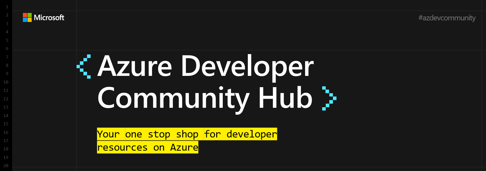

### :mega: Hey developer friends!
Welcome to the Azure Developer Community Hub with loads of content around developing on and for Azure.

What you can expect:
- [Awesome Azure](./README.md#awesome-azure): A curated list of content and resources for Azure developers
- [Azure Updates](./README.md#azure-updates): Monthly highlights of new Azure announcements and service updates 
- [Trainings & Events](./README.md#trainings--events): Regular updates of available trainings and conferences
- [Digital swag](./README.md#digital-swag): Get nerdy wallpapers and other digital assets
- [Further resources](./README.md#more-developer-content): Visit our official developer websites and social channels  
  
How to start:
- 👋 [Say hello](https://github.com/Azure/dev-community/discussions/categories/say-hello) to the community
- 💻 Join our bi-weekly [community calls](./README.md#community-calls-in-cy22)
- 🚀 [Contribute](./README.md#contributing) to the content
- ⭐ Star this repo  

## Community Calls in CY22

| Date   | Topic                                 | Action |   
|--------|---------------------------------------|--------------|
| Sep 15 @ 4pm | News & Hot Topics - Microsoft DevBox | [Register](https://mktoevents.com/Microsoft+Event/358221/157-GQE-382)         |   
| Oct 6 @ 4pm | Ask Me Anything - Cloud Native Application Development  |  [Register](https://mktoevents.com/Microsoft+Event/358196/157-GQE-382)             |   
|  Oct 20 @ 4pm  | News & Hot Topics - BestSecret on Azure  | [Register](https://mktoevents.com/Microsoft+Event/358245/157-GQE-382) |   
|  Nov 10 @ 4pm  | Ask Me Anything - [nominate a topic](https://github.com/Azure/dev-community/discussions/4)  | [Register](https://mktoevents.com/Microsoft+Event/358367/157-GQE-382) |   
|  Nov 17 @ 4pm  | News & Hot Topics - Java on Azure  | [Register](https://mktoevents.com/Microsoft+Event/358294/157-GQE-382) |   
|  Dec 1 @ 4pm  | Ask Me Anything - Java on Azure | [Register](https://mktoevents.com/Microsoft+Event/358350/157-GQE-382) |
|  Dec 15 @ 4pm  | News & Hot Topics - [nominate a topic](https://github.com/Azure/dev-community/discussions/5)  | [Register](https://mktoevents.com/Microsoft+Event/358070/157-GQE-382) |   

More info on the different formats on [aka.ms/azure4devs](https://aka.ms/azure4devs)  
Find the archive (slides, recordings, demos) of previous calls [here](./community-calls).

## Awesome Azure

If you're looking for awesome content about Azure check out our [Awesome Azure](./awesome-azure/README.md#awesome-azure-) list of curated content.
Browse through tons of tutorials, demos, blog articles, libraries, helper tools or learning resources for topics like:

- [Programming Languages](./awesome-azure/README.md#programming-languages)
- [Azure Hero Services](./awesome-azure/README.md#azure-hero-services)
- [Azure Architectures](./awesome-azure/README.md#azure-architectures)
- [Video Content](./awesome-azure/README.md#video-content)
- [Cheat Sheets](./awesome-azure/README.md#cheat-sheets)
- [Free Ebooks](./awesome-azure/README.md#free-ebooks)
- [Trainings](./awesome-azure/README.md#trainings)
- [Dev Tools](./awesome-azure/README.md#dev-tools)

## Azure Updates

Each month we are going to pick the hottest and most interesting announcements and service updates to highlight them in our [Azure updates section](./azure-updates).

Check out [September 2022's hot picks](./azure-updates/SEPTEMBER2022.md)!

## Trainings & Events

If you're looking for ... 
- free, instructor-led [training opportunities](./trainings_and_events.md#virtual-training-events) for developing on Azure
- an overview of upcoming [Microsoft hosted events](./trainings_and_events.md#microsoft-hosted)
- an overview of [external conferences](./trainings_and_events.md#conferences) where we have a booth presence

then have a look at our [Trainings & Events overview](./trainings_and_events.md).

## Digital Swag

Check out our swag folder if you're looking for cool, fresh, or retro digital resources for different purposes like:

- [Teams Backgrounds / Wallpapers](./assets/swag/teams)
- [Phones - Lock Screens](./assets/swag/phone)
- [Watch - Lock Screens](./assets/swag/watch)
- [Stickers](./assets/swag/stickers)
- [Social assets](./assets/swag/social)

## More Developer Content
* [TechWiese](https://aka.ms/techwiese)
* [Twitter](https://twitter.com/msdev_de)

## Contributing
Contributions are very welcome! 

- [Awesome Azure](./CONTRIBUTING.md#awesome-azure): Contribute to our list of curated Azure developer content
- [Trainings & Events](./CONTRIBUTING.md#trainings-and-events): Let the community know if you are presenting at local meetups and/or conferences.
- [Let us know](https://github.com/Azure/dev-community/discussions) if you have any ideas for improvement or feedback.

Happy contributing! 🙂
