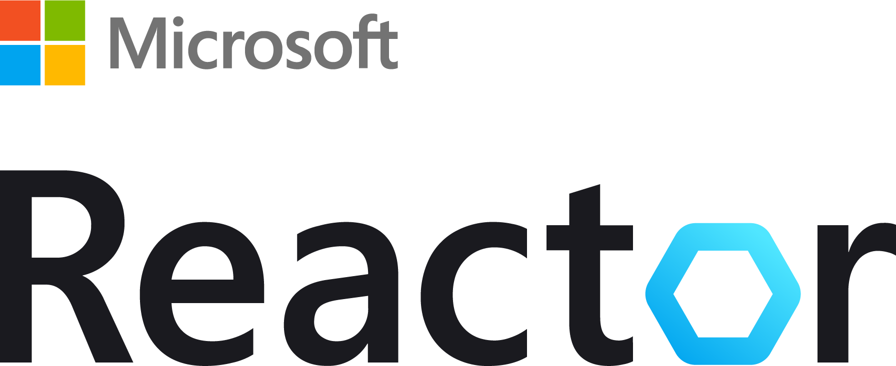

# Trainings & Events

## Overview of available training formats
All of the training formats presented here are free of charge.

|        | Format   | Level |Description                          |   
|--------|---------|--------|-------------------------------------|
| | [Azure Adventure Day](https://aka.ms/azure-adventure-day) | Advanced | Azure Adventure Days are a fun way to measure your Kubernetes skills against other teams in a real-world, risk-free, and challenging environment (guided by a coach).  |   
| | [Azure Immersion Workshops](https://www.microsoft.com/de-de/techwiese/events/immersion-workshops.aspx) | Intermediate | Free, 1-day hands-on workshops delivered by a partner. |   
| | [Azure Virtual Training Days](https://www.microsoft.com/de-de/techwiese/events/microsoft-training-days.aspx)| Beginner | Free, 2-day virtual trainings delivered by a partner. |   
| | [Cloud Skills Challenges](https://www.microsoft.com/de-de/techwiese/events/cloud-skills-challenge.aspx)| Beginner | A fun, free and interactive skilling program to compete against other learners. |   
|  | [Microsoft Reactor Popup Berlin](https://www.microsoft.com/de-de/techwiese/events/microsoft-reactor.aspx) | All Levels | Microsoft Reactor connects you with the developers and startups that share your goals. Learn new skills, meet new peers, develop new ideas. |

 

## Microsoft hosted

### [IN-PERSON] Training Events
| Date   | Time   | Format & Topic | Language                     |   Location | Action |
|--------|---------|--------|-------------------------------------|------------|--------|
| Mar 14 - 15 | Full day | **Azure Solution Summit** | EN | Munich (Microsoft Office) | Registration opens in CY23

 

### [HYBRID] Microsoft Reactor Popup Berlin!
| Date   | Time   | Topic | Language                     |   Location | Action |
|--------|---------|--------|-------------------------------------|------------|--------|
| Jan 19 | 4 - 8pm | **.NET Conf After Party** | EN | Berlin Kreuzberg or virtual | [Register now!](https://reactor.microsoft.com/en-us/reactor/events/17744/) 
| Feb 16 | 4 - 8pm | **TBD - Save the date** | EN | Berlin Kreuzberg or virtual | Registration available soon 

 

### [VIRTUAL] Training Events

| Date   | Time   | Format & Topic | Language                     |   Action |
|--------|---------|--------|-------------------------------------|----------------|
| Dec 21 | 9 - 12.15am | **Azure Virtual Training Day: Linux OSS Database Migration** | DE | [Register now](https://mktoevents.com/Microsoft+Event/367981/157-GQE-382)|
| Dec 28 & 29 | 9 - 11.15am | **Azure Virtual Training Day: Fundamentals** | DE |[Register now](https://mktoevents.com/Microsoft+Event/368475/157-GQE-382)|
| Jan 23 & 24 | 9 - 11.30am | **Azure Virtual Training Day: Cloud-Native Apps** | DE |[Register now](https://mktoevents.com/Microsoft+Event/371448/157-GQE-382)|
| Jan 26 | 9am - 4pm | **Azure Immersion Workshop: DevOps with GitHub** | DE | [Register now](https://mktoevents.com/Microsoft+Event/377005/157-GQE-382)|
| Feb 9 | 9am - 4pm | **Azure Immersion Workshop: Cloud Native Apps** | DE | [Register now](https://mktoevents.com/Microsoft+Event/378182/157-GQE-382)|
| Feb 13 & 14 | 9 - 11.15am | **Azure Virtual Training Day: Fundamentals** | DE |[Register now](https://mktoevents.com/Microsoft+Event/374103/157-GQE-382)|
| Feb 22 & 23 | 9 - 12pm/11.30am | **Azure Virtual Training Day: Modernize .NET Apps** | DE |[Register now](https://mktoevents.com/Microsoft+Event/376369/157-GQE-382)|

 

---

## External
### [IN-PERSON] Conferences
| Date   | Time   | Event Name | Language                     |   Location | More information |
|--------|---------|--------|-------------------------------------|------------|--------|
| Mar 21-23 | Full day | JavaLand 2023 | EN & DE | Phantasialand Brühl | [Website](https://www.javaland.eu/de/home/)|
 

### Meetups

